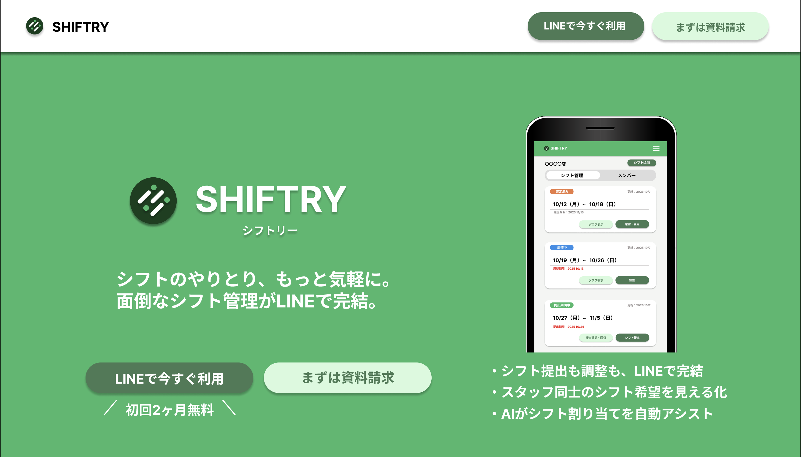

# 🚀 SHIFTRY 

現在、LINEグループを活用したシフト管理SaaS **「SHIFTRY」** を開発中です（※開発段階）。

ターゲットはITリテラシーの低い小規模事業者で、LINEだけでシフト提出・調整が完結できる、シンプル機能・低価格のSaaSを目指しています。
沖縄で暮らす中で、未だにExcelや手書きでシフトを管理している店舗が多い現状に課題を感じ、「もっと気軽に、効率よくシフトを組める環境を届けたい」という想いから開発に至りました。。

---

## ✨ 導入までのステップ

1.  **オーナーがLINE BOT「SHIFTRY」を追加**
2.  **line認証＆オーナー・店舗登録**
3.  **Botを店舗のlineグループに招待**
4.  **完了**

- スタッフは、lineグループ内に「シフト提出依頼通知」の際に送信されたリンクから登録・ログインして、利用します。

## 技術スタック

## 🧩 使用技術
| フロント | バックエンド | DB | 認証 |
| --- | --- | --- | --- |
| TypeScript | TypeScript | neon | LineOauth |
| Next.js | express | prisma | LIFF |
| Redux |  |  | Cookie認証 |
| TailwindCSS |  |  | JWT |
| daisyUI |  |  |  |

| インフラ | 外部API | テスト・フォーマット | その他 |
| --- | --- | --- | --- |
| Vercel (フロント) | line api | githubActions | Figma |
| AWS ECS（バックエンド） | stripe | jest | Notion |
|  | openAI api | biome | miro |
|  |  |  | postman |
